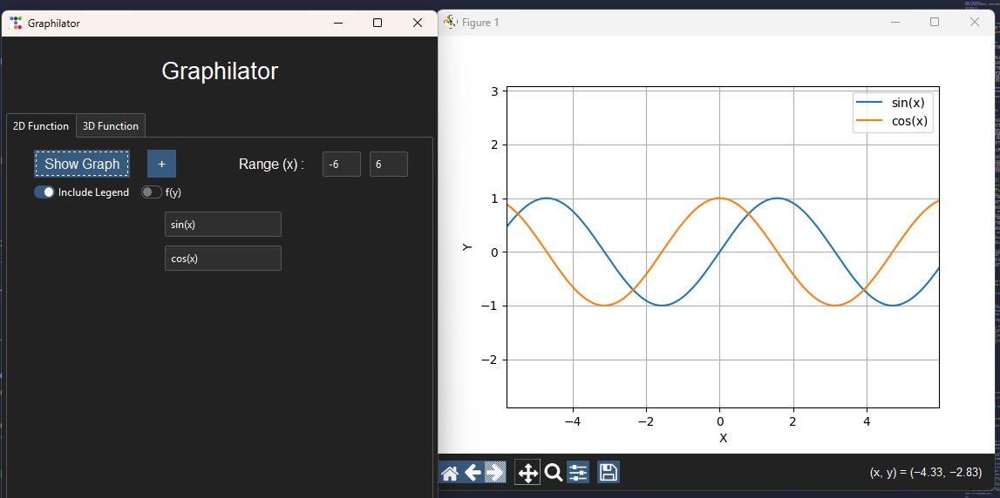
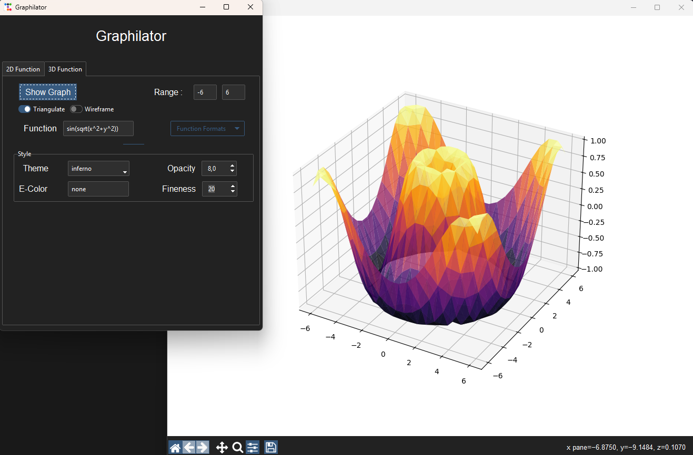

### Graph Calculator

A simple but useful design made with numpy, matplotlib, and [ttkbootstrap](https://github.com/ddaneil/turbo-spoon).  
Used to visualize 2 dimensional functions or 3 dimensional functions

---

## Features

- 2D Function plotting, random colored lines with a maximum of *30* 2D functions
- 3D Function plotting, which has 3 types:
  - Surface Plotting (*default*)
  - Wireframe Plotting
  - Triangulation
---

# Screenshots

